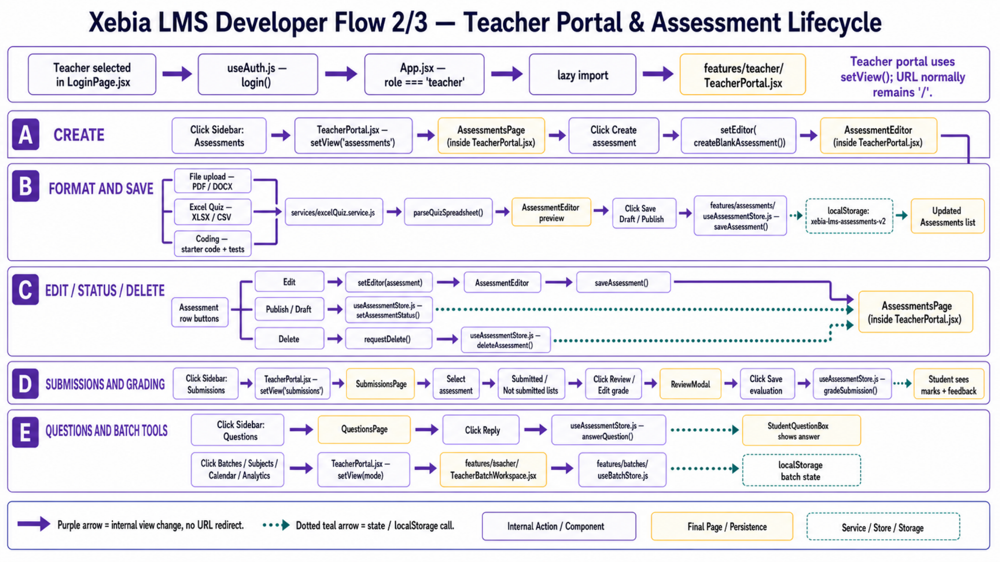
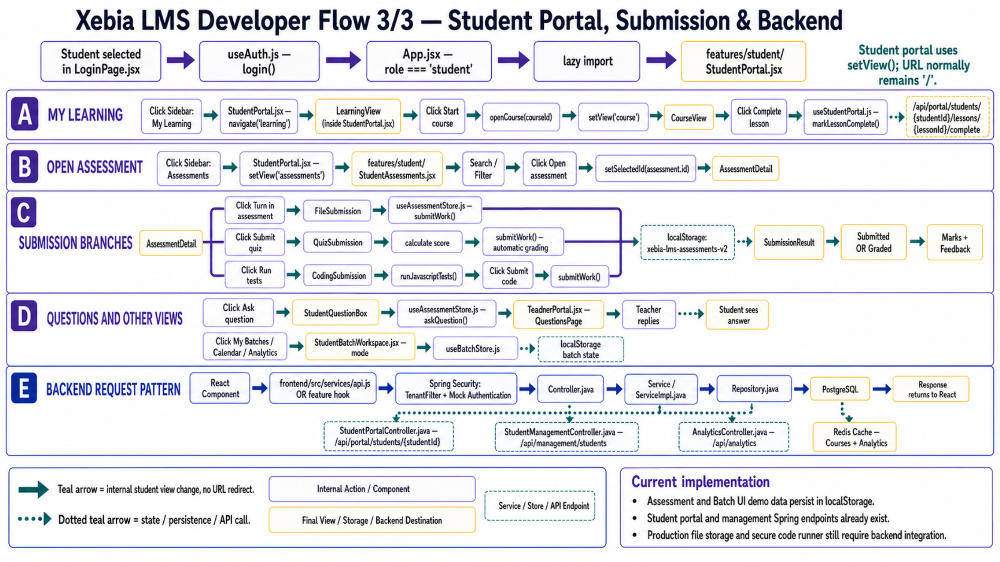

# 5. Feature Documentation

[Back to documentation index](README.md)

## Role matrix

| Capability | Admin | Teacher | Student | Current data owner |
| --- | --- | --- | --- | --- |
| Dashboard | Yes | Yes | Yes | Mixed frontend/backend. |
| Categories and courses | Manage | View through assigned content | View assigned courses | Backend-capable via `useLmsStore`. |
| Curriculum and content | Manage | Subject workspace prototype | Learn and complete lessons | Core backend + student portal API. |
| Students and tasks | Manage | Submission tracking | View/submit | Backend-capable. |
| Batches and join codes | - | Manage | Join/view | Frontend localStorage. |
| Subjects, announcements, discussions, attendance | - | Manage | View/participate | Frontend localStorage. |
| Assessments | - | CRUD/publish/allocate | View/submit | Backend APIs when enabled; localStorage fallback. |
| Grading | Review Admin tasks | Grade assessment work | View marks/feedback | Mixed: assessment grading local; Admin task review backend-capable. |
| Analytics | Enterprise sections | Batch/course summary | Personal summary | Admin analytics backend; portal analytics local. |

## Admin features

### Dashboard

`DashboardPage.jsx` summarizes categories, courses, curriculum, and content. Shortcuts navigate with React Router.

### Category management

Create, edit, list, delete, and preview learning categories. Backend support includes tenant-aware listing and tree retrieval.

### Course management

Create/edit courses, control published/active state, open curriculum, and manage draft/review/publish lifecycle. Course reads are cached in Redis on the backend.

### Curriculum and content

Manage ordered modules, submodules, and content blocks. Supported content metadata covers notes, videos, PDFs, PPTs, code/text blocks, and other UI block types.

### Student management

Add students, toggle status, assign courses, create tasks, view submissions, and complete reviews through `StudentsPage.jsx` and `useStudentManagement.js`.

### Learning analytics

Executive summary, coverage, hours, pillars, AI transformation, certifications, flagship programs, trends, training effectiveness, champions, investment, and fresher journey.

## Teacher features

### Batch management

- Create, edit, archive, and delete batches.
- Store capacity, teacher, department, semester, year, status, and description.
- Generate, regenerate, enable, disable, and copy join codes.
- Review batch metrics and students.

Current owner: `TeacherBatchWorkspace.jsx` + `useBatchStore.js` + localStorage. Assessment allocation stores batch IDs in the backend, but batch entities themselves remain frontend-local.

### Subject management

Create subjects and assign them to batches. Subject workspaces can expose lessons, assignments, quizzes, files, sessions, announcements, and discussions.

### Assessments

- Create, edit, publish, move to draft, and delete.
- Formats: PDF/DOCX file work, Excel/CSV quiz, and coding exercise.
- Allocation: entire course, selected batches, or selected students.
- Track Submitted, Not submitted, and Graded counts.
- Review files/code, edit scores, and save feedback.
- Answer student questions.

### Excel quiz import

`excelQuiz.service.js` expects `Question`, `Option A`, `Option B`, and `Correct Answer`; optional fields include Option C/D, Marks, and Explanation. Correct Answer may be A-D or exact option text. The browser validates rows and converts them into quiz questions.

### Attendance, announcements, and discussion

Teachers can record attendance, publish/edit/delete batch announcements, create discussions, reply, and pin important threads. These features currently persist locally.

## Student features

### Dashboard and My Learning

View assigned courses, progress, upcoming work, live sessions, activities, deadlines, streaks, and recommendations. Course cards open `CourseView`, where lessons can be completed and discussed.

### My Batches

Join with an enabled code, view batch details, teacher, subjects, assignments, quizzes, sessions, materials, announcements, attendance, and discussions.

### Assessments

- Search, sort, and filter All, To do, Submitted, Graded, Upcoming, and Overdue.
- Open only assessments allocated to the student, course, or joined batch.
- Submit allowed PDF/DOCX files before the deadline.
- Answer every imported quiz question and receive automatic marks.
- Edit JavaScript code, run visible/hidden tests, and submit results.
- View teacher scores, feedback, quiz answer review, and submission status.
- Ask a question within the assessment workspace.

### Calendar and analytics

The calendar combines assignment, quiz, live-session, and deadline dates. Student analytics summarize progress, weekly learning, quiz performance, assignments, and attendance from available portal state.

## Current limitations and next backend work

1. Normalize assessment submissions/grades instead of serializing them through student tasks.
2. Add durable object storage and malware/type validation for files.
3. Add an isolated, time-limited coding runner rather than executing untrusted code in the browser.
4. Persist batches, join codes, subjects, announcements, discussions, and attendance.
5. Replace seeded Admin/Teacher and mock header authentication with production identity/token validation.
