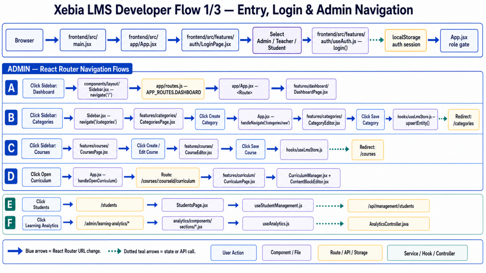
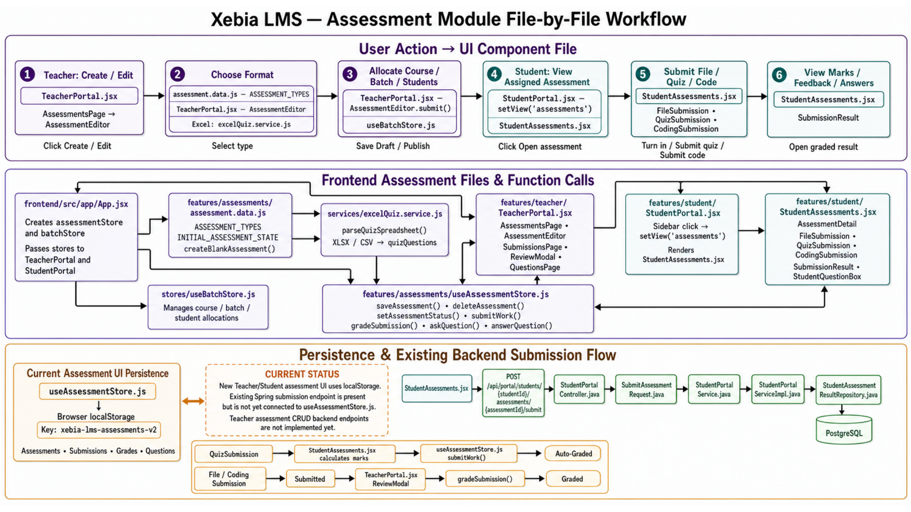

# Xebia LMS Technical Documentation

This directory is the onboarding and maintenance guide for the Xebia LMS. It documents the current implementation in `frontend/` and `backend/`, including the parts that still run as frontend prototypes.

## Documentation map

| Section | Purpose |
| --- | --- |
| [1. Architecture documentation](<1. architecture_documentation/README.md>) | System boundaries, runtime architecture, security model, state ownership, and integration status. |
| [2. Backend implementation](<2. backend_implementation/README.md>) | Spring Boot packages, controller-service-repository flow, caching, errors, and extension rules. |
| [3. Frontend implementation](<3. frontend_implementation/README.md>) | React entry flow, routing, portals, feature folders, state hooks, styling, and component navigation. |
| [4. API documentation](<4. api_documentation/README.md>) | Current REST resources, headers, status codes, Swagger, and frontend consumers. |
| [5. Feature documentation](<5. feature_documentation.md>) | User-facing capabilities by Admin, Teacher, and Student role. |
| [6. Execution flows](<6. execution_flows/README.md>) | Click-to-file flows for login, admin navigation, assessment creation, submission, and grading. |
| [7. Database documentation](<7. database_documentation/README.md>) | PostgreSQL tables, relationships, Flyway migrations, indexes, and frontend-only data. |
| [8. Configuration and deployment](<8. configuration_deployment/README.md>) | Local startup, environment variables, build checks, Redis/PostgreSQL, and deployment checklist. |
| [Full technical documentation](full_technical_documentation.md) | Single-page consolidated handoff guide. |
| [HTML version](full_technical_documentation.html) | Browser-friendly documentation index and project overview. |
| [Workflow PDF](assets/Xebia-LMS-Developer-Workflow.pdf) | Original four-page developer workflow supplied by the team. |

## Current implementation summary

- The Admin UI uses React Router routes from `frontend/src/app/routes.js`.
- Teacher and Student portals use internal `setView(...)` state inside their portal components; the URL normally remains `/`.
- Core Admin course/category/module/submodule/content data can use the Spring API when `VITE_ENABLE_API=true`, with localStorage fallback.
- Assessments use `/api/assessments`, Q&A, file upload, and student-task/review APIs when `VITE_ENABLE_API=true`; localStorage remains the offline/demo fallback.
- Batch, join-code, subject, announcement, attendance, and discussion modules currently persist in browser localStorage.
- Security currently uses tenant and mock user headers. It does not issue or verify JWTs.

## Workflow images

## Maintaining these documents

When a feature changes, update the feature page, its execution flow, and the API/database page if ownership or persistence changed. Use repository-relative links and distinguish implemented behavior from planned integration.
